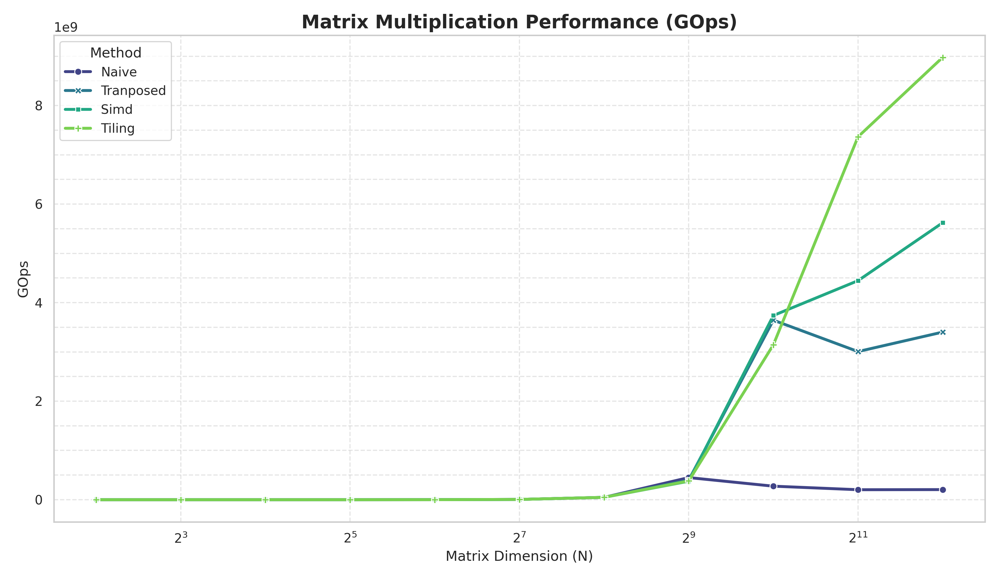

# GEMM
`experimental C++26`, `SIMD`, `matrix multiplication`

> Another low latency experiment ported over because its deserves its own repository

## Motivation

Working with [SWAR](https://github.com/lim-james/swar-stoi) wasn't enough, I
wanted to experience the true SIMD benefits. Was an opportunity to be exposed to
cpp26 documentations and experimental features.

# Benchmark Results

The following tables present the performance metrics for different algorithms across various problem sizes.

**Legend:**
* **k, M, G:** Kilo ($10^3$), Mega ($10^6$), Giga ($10^9$).
* **Scaling (x):** The value in parentheses compares the algorithm's performance to the **Naive** implementation.
    * For **GOps** and **Bandwidth**, this is **Throughput Improvement** (Algo / Naive). Values $> 1.0$x indicate higher throughput.

#### GOps (Billions of Operations per Second)

|   Size | Naive   | Transposed      | Simd            | Tiling          |
|-------:|:--------|:----------------|:----------------|:----------------|
|      4 | 183.40  | 182.12 (0.99x)  | 182.93 (1.00x)  | 150.27 (0.82x)  |
|      8 | 1.49k   | 1.46k (0.98x)   | 1.47k (0.99x)   | 1.47k (0.99x)   |
|     16 | 11.12k  | 11.94k (1.07x)  | 11.56k (1.04x)  | 10.73k (0.96x)  |
|     32 | 96.97k  | 92.94k (0.96x)  | 92.89k (0.96x)  | 93.50k (0.96x)  |
|     64 | 739.54k | 749.09k (1.01x) | 1.04M (1.41x)   | 753.08k (1.02x) |
|    128 | 5.97M   | 5.98M (1.00x)   | 5.54M (0.93x)   | 6.03M (1.01x)   |
|    256 | 47.21M  | 48.61M (1.03x)  | 48.14M (1.02x)  | 48.01M (1.02x)  |
|    512 | 449.29M | 396.31M (0.88x) | 375.03M (0.83x) | 381.22M (0.85x) |
|   1024 | 274.70M | 3.64G (13.26x)  | 3.74G (13.61x)  | 3.14G (11.44x)  |
|   2048 | 202.71M | 3.01G (14.83x)  | 4.45G (21.93x)  | 7.36G (36.33x)  |
|   4096 | 205.20M | 3.40G (16.58x)  | 5.62G (27.39x)  | 8.98G (43.75x)  |

#### Bandwidth

|   Size | Naive   | Transposed      | Simd            | Tiling          |
|-------:|:--------|:----------------|:----------------|:----------------|
|      4 | 275.11  | 273.19 (0.99x)  | 274.40 (1.00x)  | 225.40 (0.82x)  |
|      8 | 1.12k   | 1.10k (0.98x)   | 1.10k (0.99x)   | 1.10k (0.99x)   |
|     16 | 4.17k   | 4.48k (1.07x)   | 4.33k (1.04x)   | 4.02k (0.96x)   |
|     32 | 18.18k  | 17.43k (0.96x)  | 17.42k (0.96x)  | 17.53k (0.96x)  |
|     64 | 69.33k  | 70.23k (1.01x)  | 97.86k (1.41x)  | 70.60k (1.02x)  |
|    128 | 279.80k | 280.52k (1.00x) | 259.88k (0.93x) | 282.78k (1.01x) |
|    256 | 1.11M   | 1.14M (1.03x)   | 1.13M (1.02x)   | 1.13M (1.02x)   |
|    512 | 5.27M   | 4.64M (0.88x)   | 4.39M (0.83x)   | 4.47M (0.85x)   |
|   1024 | 1.61M   | 21.35M (13.26x) | 21.90M (13.61x) | 18.41M (11.44x) |
|   2048 | 593.86k | 8.81M (14.83x)  | 13.02M (21.93x) | 21.58M (36.33x) |
|   4096 | 300.59k | 4.98M (16.58x)  | 8.23M (27.39x)  | 13.15M (43.75x) |

#### L1D cache misses (min)
|   SIZE | NAIVE   | TRANSPOSED      | SIMD            | TILING          |
|-------:|:--------|:----------------|:----------------|:----------------|
|      4 | 16.00   | 25.00 (1.56x)   | 21.00 (1.31x)   | 19.00 (1.19x)   |
|      8 | 41.00   | 35.00 (0.85x)   | 28.00 (0.68x)   | 35.00 (0.85x)   |
|     16 | 75.00   | 74.00 (0.99x)   | 73.00 (0.97x)   | 88.00 (1.17x)   |
|     32 | 231.00  | 212.00 (0.92x)  | 214.00 (0.93x)  | 235.00 (1.02x)  |
|     64 | 839.00  | 1.03k (1.22x)   | 936.00 (1.12x)  | 1.60k (1.91x)   |
|    128 | 526.39k | 132.42k (0.25x) | 132.00k (0.25x) | 22.68k (0.04x)  |
|    256 | 4.27M   | 1.06M (0.25x)   | 1.06M (0.25x)   | 447.18k (0.10x) |
|    512 | 33.88M  | 8.49M (0.25x)   | 8.49M (0.25x)   | 5.06M (0.15x)   |
|   1024 | -       | 68.08M          | 68.09M (1.00x)  | 57.14M (0.84x)  |
|   2048 | -       | 547.22M         | 548.38M (1.00x) | 486.70M (0.89x) |

#### LLC cache misses (avg)
|   SIZE | NAIVE   | TRANSPOSED      | SIMD            | TILING          |
|-------:|:--------|:----------------|:----------------|:----------------|
|      4 | 12.20   | 131.80 (10.80x) | 23.00 (1.89x)   | 19.90 (1.63x)   |
|      8 | 21.90   | 98.60 (4.50x)   | 28.60 (1.31x)   | 72.40 (3.31x)   |
|     16 | 42.30   | 65.20 (1.54x)   | 24.50 (0.58x)   | 113.90 (2.69x)  |
|     32 | 55.10   | 97.40 (1.77x)   | 44.80 (0.81x)   | 106.40 (1.93x)  |
|     64 | 190.00  | 128.40 (0.68x)  | 110.10 (0.58x)  | 210.20 (1.11x)  |
|    128 | 613.90  | 289.30 (0.47x)  | 179.30 (0.29x)  | 1.94k (3.16x)   |
|    256 | 231.29k | 9.52k (0.04x)   | 8.06k (0.03x)   | 17.84k (0.08x)  |
|    512 | 32.20M  | 207.20k (0.01x) | 198.68k (0.01x) | 166.27k (0.01x) |
|   1024 | -       | 1.60M           | 1.55M (0.97x)   | 1.57M (0.98x)   |
|   2048 | -       | 13.94M          | 14.26M (1.02x)  | 19.89M (1.43x)  |

#### CPU Cycles
|   SIZE | NAIVE   | TRANSPOSED      | SIMD            | TILING          |
|-------:|:--------|:----------------|:----------------|:----------------|
|      4 | 890.20  | 5.91k (6.64x)   | 1.25k (1.41x)   | 1.50k (1.69x)   |
|      8 | 1.56k   | 7.18k (4.62x)   | 2.48k (1.59x)   | 4.07k (2.62x)   |
|     16 | 6.76k   | 7.45k (1.10x)   | 4.84k (0.72x)   | 9.12k (1.35x)   |
|     32 | 30.99k  | 28.15k (0.91x)  | 25.88k (0.84x)  | 31.33k (1.01x)  |
|     64 | 245.44k | 185.70k (0.76x) | 183.36k (0.75x) | 220.70k (0.90x) |
|    128 | 2.34M   | 1.65M (0.70x)   | 1.66M (0.71x)   | 1.77M (0.76x)   |
|    256 | 17.70M  | 13.13M (0.74x)  | 13.04M (0.74x)  | 13.79M (0.78x)  |
|    512 | 292.10M | 108.75M (0.37x) | 108.97M (0.37x) | 110.13M (0.38x) |
|   1024 | -       | 1.09G           | 1.10G (1.00x)   | 898.54M (0.82x) |
|   2048 | -       | 12.64G          | 12.75G (1.01x)  | 7.33G (0.58x)   |

#### Instructions
|   SIZE | NAIVE   | TRANSPOSED      | SIMD            | TILING          |
|-------:|:--------|:----------------|:----------------|:----------------|
|      4 | 403.00  | 442.50 (1.10x)  | 484.00 (1.20x)  | 561.00 (1.39x)  |
|      8 | 1.94k   | 2.58k (1.34x)   | 2.20k (1.13x)   | 2.07k (1.07x)   |
|     16 | 17.78k  | 17.80k (1.00x)  | 14.54k (0.82x)  | 13.19k (0.74x)  |
|     32 | 134.24k | 86.40k (0.64x)  | 86.40k (0.64x)  | 97.07k (0.72x)  |
|     64 | 1.06M   | 639.86k (0.60x) | 641.62k (0.61x) | 774.81k (0.73x) |
|    128 | 8.43M   | 7.62M (0.90x)   | 8.11M (0.96x)   | 6.19M (0.73x)   |
|    256 | 67.28M  | 59.97M (0.89x)  | 64.10M (0.95x)  | 48.79M (0.73x)  |
|    512 | 537.53M | 474.22M (0.88x) | 507.25M (0.94x) | 390.81M (0.73x) |
|   1024 | -       | 3.78G           | 4.04G (1.07x)   | 3.12G (0.83x)   |
|   2048 | -       | 30.14G          | 32.28G (1.07x)  | 25.40G (0.84x)  |

#### IPC
|   SIZE | NAIVE   | TRANSPOSED   | SIMD         | TILING       |
|-------:|:--------|:-------------|:-------------|:-------------|
|      4 | 0.45    | 0.07 (0.16x) | 0.39 (0.87x) | 0.37 (0.82x) |
|      8 | 1.24    | 0.36 (0.29x) | 0.89 (0.72x) | 0.51 (0.41x) |
|     16 | 2.63    | 2.39 (0.91x) | 3.01 (1.14x) | 1.45 (0.55x) |
|     32 | 4.33    | 3.07 (0.71x) | 3.34 (0.77x) | 3.10 (0.72x) |
|     64 | 4.32    | 3.45 (0.80x) | 3.50 (0.81x) | 3.51 (0.81x) |
|    128 | 3.60    | 4.63 (1.29x) | 4.88 (1.36x) | 3.49 (0.97x) |
|    256 | 3.80    | 4.57 (1.20x) | 4.91 (1.29x) | 3.54 (0.93x) |
|    512 | 1.84    | 4.36 (2.37x) | 4.66 (2.53x) | 3.55 (1.93x) |
|   1024 | -       | 3.45         | 3.69 (1.07x) | 3.48 (1.01x) |
|   2048 | -       | 2.38         | 2.53 (1.06x) | 3.47 (1.46x) |
